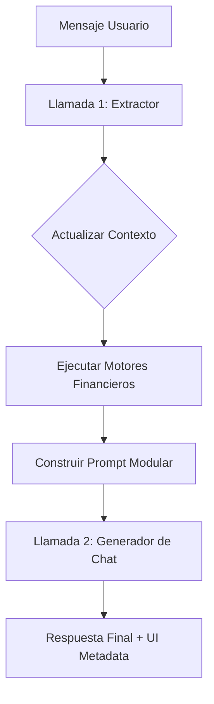

# Informe del Sistema LLM - Proyecto Flux versión descartada

Este documento detalla la arquitectura del sistema de inteligencia artificial implementado en la versión anterior del proyecto. Este sistema fue diseñado para dotar al agente conversacional de capacidades multimodales, de extracción de datos y de conocimiento contextualizado. El proyecto anterior fue descartado por fallas a nivel de lógica y orquestación, producidas por código spagetti. Los resultados del manejo del LLM propiamente tal, en cambio, fueron positivos, se mantuvo una alta calidad de respuesta, se mostró con características humanas y logró sus objetivos de manera eficiente.

Este informe no pretende que la arquitectura sea reutilizada, sino dar cuenta de las buenas prácticas identificadas en el manejo del LLM, con el objetivo de que pueda dar luces de como mejorar el sistema en la versión actual, dadas las problemáticas encontradas.

## 1. Arquitectura de Clientes (LLM Clients)
El proyecto implementa un sistema de abstracción para los modelos de IA basado en una clase base y una implementación específica para Google Vertex AI.

- **AIClient (Base):** Define la interfaz contractualmente obligatoria para cualquier cliente de IA. Incluye métodos para generar_respuesta, generar_embedding y extraer_entidades.
- **GeminiVertexClient:** Es la implementación principal que utiliza el SDK de Vertex AI.
    - **Doble Inicialización:** Implementa un patrón híbrido para maximizar estabilidad:
        - **Brazo Regional (us-central1):** Optimizado para la generación de Embeddings Matryoshka (768d).
        - **Brazo Global:** Utilizado para las capacidades de Chat y Extracción, garantizando acceso a las versiones más recientes de los modelos (Gemini 3 Flash).
    - **Separación de Modelos:** Utiliza diferentes modelos configurables para chat (chat_model_id) y para extracción (extract_model_id), permitiendo optimizar costos y velocidad.

## 2. Lógica de Prompts Modulares
El sistema utiliza un PromptFactory que implementa un patrón denominado "Amnesia Selectiva". En lugar de un prompt estático gigante, el sistema construye el System Prompt dinámicamente según el contexto actual.

**Estructura de Construcción:**

- **Core Prompt:** Identidad de Flux y reglas globales de comportamiento.
- **Módulo de Hito (Milestone):** Carga instrucciones específicas según el paso del flujo en el que se encuentre el usuario (ej: recoleccion_datos, simulacion, formalizacion). *NOTA: ANTES NO ESTÁBAMOS USANDO LANGGRAPH, POR LO TANTO NO ESTÁBAMOS USANDO NODOS. LA LÓGICA SE MANEJABA A PARTIR DE MILESTONES, CON PYTHON PURO, Y HACÍA QUE FUERA MUY DIFÍCIL MANTENER EL CONTROL DEL FLUJO. ASÍ QUE, EN ESTE PUNTO, CUANDO SE HABLA DE MILESTONES, SERÍA EL EQUIVALENTE A NODOS EN NUESTRO FLUJO ACTUAL CON LANGGRAPH.*
- **Contexto de Sesión:** Inyecta los datos conocidos del usuario (nombre, RUT, etc.) para que el LLM no los vuelva a pedir. *NOTA: ESTO YA LO HACE ACTUALMENTE EL NODO DE WELCOME_NODE, Y ES INYECTADO A FLUX_STATE, DE FORMA MUCHÍSIMO MÁS SÓLIDA QUE LA VERSIÓN ANTERIOR DEL PROYECTO.*
- **Reglas de Negocio (RAG):** Inyecta fragmentos de conocimiento recuperados de la base de datos vectorial relevantes para la consulta actual.
- **Formato:** Reglas finales de estilo y restricciones de respuesta.
Este enfoque modular permite que el modelo se enfoque exclusivamente en la tarea actual del flujo financiero sin distracciones de lógica irrelevante.

## 3. Extracción de Datos (Motor de Alta Precisión)

La extracción es la Llamada 1 del sistema ("Doble Motor"). Se realiza de forma independiente a la respuesta conversacional.
- Formato de Salida: JSON Puro.
- Modelo: Optimizado para baja latencia (Flash-Lite) con temperature=0.0 para máxima fidelidad.
- Esquema de Extracción:

```json
{
  "datos": {
    "current_product": "CREDITO_CONSUMO" | "CUENTA_CORRIENTE" | "DAP" | null,
    "full_name": string | null,
    "rut": string | null,
    "edad": integer | null,
    "renta_liquida": integer | null,
    "antiguedad_meses": integer | null,
    "monto_solicitado": integer | null,
    "plazo_meses": integer | null,
    "moneda": "CLP" | "USD" | "UF" | null
  },
  "intencion": "SOLICITUD" | "DATA_INPUT" | "PREGUNTA" | "CONFIRMACION" | "CAMBIO_PRODUCTO" | "SALUDO" | "OTRO",
  "valido": true
}
```

- Reglas Críticas: El motor detecta intenciones y mapea términos coloquiales ("pedir plata" -> CREDITO_CONSUMO) a categorías de negocio.

## 4. Generación de Respuestas y Flujo de Ejecución

La generación de la respuesta final es la Llamada 2 y sigue un proceso secuencial:

- Fase 1 (Extracción): Se analiza el mensaje del usuario para capturar datos estructurados e intención.
- Puente de Estado (State Bridge): Los datos extraídos se persisten en el contexto de la sesión y se actualiza el "Hito" (milestone) del flujo si es necesario.
- Motores de Negocio: Se ejecutan los algoritmos financieros (evaluación de crédito, simuladores) utilizando los datos actualizados.
- Recuperación RAG: Se buscan reglas legales o bancarias específicas según el mensaje.
- Fase 3 (Generación): Se invoca al modelo de chat con el historial sanitizado y el prompt modular construido por la fábrica.
- Captura de "JSON Huérfano": Como mecanismo de seguridad, el orquestador tiene lógica para detectar y procesar bloques <json> que el modelo de chat pueda inyectar en su respuesta final si detecta datos nuevos durante la conversación.

**Resumen del Flujo:**



Este diseño garantiza que el LLM sea "inteligente" (conversacional) pero esté estrictamente gobernado por la lógica de negocio y los datos persistidos en el sistema.

## 5. Logs de Ejemplo de una Conversación Real

[FLUX] >>> ENTRADA (Sanitizada): 'Quiero un crédito de consumo'

INFO:     [AI] Extracción exitosa: SOLICITUD
INFO:     [FLUX] [EXTRACT] OK (9405ms) | Datos: {'current_product': 'CRE, 'edad': None, 'renta_liquida': None, 'antiguedad_meses': None, 'nivel_lazo_meses': None, 'plazo_dias': None, 'moneda': None} | Intención: SOLI
INFO:     [FLUX] [BRIDGE] Hito actualizado: None -> recoleccion_datos
INFO:     [FLUX] [BRIDGE] OK (1269ms) | Hito: recoleccion_datos | Prod: 
INFO:     [ORQUESTADOR] edad_calculada no disponible para session 9db759
INFO:     [FLUX] [RAG] OK (1168ms) | Reglas: RN-14, RN-26, RN-01
INFO:     [ORQUESTADOR] JSON Huérfano detectado en Llamada 2: {'full_nam 'edad': 29, 'monto_solicitado': None, 'plazo_meses': None, 'plazo_dias'one, 'nivel_estudios': None, 'antiguedad_meses': None}
INFO:     [FLUX] [CHAT] OK (7360ms)
INFO:     [FLUX] <<< SALIDA: '¡Hola AXLTL Audiovisual! Qué b...'
INFO:     [FLUX] TOTAL: 20594ms

INFO:     [AUTH] Token decodificado. UserID: d033c377-96d7-4357-a8c6-eea
[AUTH_TRACE] Edad calculada para d033c377-96d7-4357-a8c6-eea4025f0871: 2
[AUTH] /lista para usuario: d033c377-96d7-4357-a8c6-eea4025f0871
INFO:     [AUTH] Token decodificado. UserID: d033c377-96d7-4357-a8c6-eea
[AUTH_TRACE] Edad calculada para d033c377-96d7-4357-a8c6-eea4025f0871: 2
INFO:     
[FLUX] >>> ENTRADA (Sanitizada): 'Buenísimo, gano 3 palos mensua...'
INFO:     [AI] Extracción exitosa: DATA_INPUT
INFO:     [FLUX] [EXTRACT] OK (16717ms) | Datos: {'current_product': Nonne, 'renta_liquida': 3000000, 'antiguedad_meses': 60, 'nivel_estudios': : None, 'plazo_dias': None, 'moneda': 'CLP'} | Intención: DATA_INPUT
INFO:     [FLUX] [BRIDGE] OK (514ms) | Hito: recoleccion_datos | Prod: C
INFO:     [ORQUESTADOR] edad_calculada no disponible para session 9db759
INFO:     [FLUX] [RAG] OK (1010ms) | Reglas: RN-24, RN-37, RN-07
INFO:     [ORQUESTADOR] JSON Huérfano detectado en Llamada 2: {'full_nam 'edad': 29, 'monto_solicitado': None, 'plazo_meses': None, 'plazo_dias'000000, 'nivel_estudios': None, 'antiguedad_meses': 60}
INFO:     [FLUX] [CHAT] OK (9243ms)
INFO:     [FLUX] <<< SALIDA: '¡Excelente! Con una renta de $...'
INFO:     [FLUX] TOTAL: 28803ms

INFO:     [AUTH] Token decodificado. UserID: d033c377-96d7-4357-a8c6-eea77-96d7-4357-a8c6-ee
a4025f0871                                         -a8c6-eea4025f0871: 2
[AUTH_TRACE] Edad calculada para d033c377-96d7-4357-a8c6-eea4025f0871: 
29 (DOB: 1996-07-11)                               il Informátic...'    
INFO:
[FLUX] >>> ENTRADA (Sanitizada): 'Soy Ingeniero Civcurrent_product': Nonil Informátic...'   , 'rut': None, 'edad': None, 'renta_liquida': None, 
                                                   ado', 'monto_solicita
INFO:     [AUTH] Token decodificado. UserID: d033c3 'moneda': None} | In77-96d7-4357-a8c6 No
-eea4025f0871                                      cion_datos -> simulac
[AUTH_TRACE] Edad calculada para d033c377-96d7-4357-a8c6-eea4025f087es': None, 'nivel_estudios': 'postcion | Prod: CREDITO_1: 29 (DOB: 1996-07-11)
INFO:                                              ITO_CONSUMO. Faltan: 
[FLUX] >>> ENTRADA (Sanitizada): 'Soy Ingeniero Civil Informátic...'_INPUT


INFO:     [AUTH] Token decodificado. UserID: d033c377-96d7-4357-ct':[BRIDGE] OK (667ms) | Hito: simulaa8c6-eea4025f0871
[AUTH_TRACE] Edad calculada para d033c377-96d7-4357-a8c6-eea4025guedad_meses': None, 'nivel_estudios':f0871: 29 (DOB: 1996-07-11)
INFO:
[FLUX] >>> ENTRADA (Sanitizada): 'Soy Ingeniero Civil Informátic Intención: DATA_INPUT
...'

INFO:     [AUTH] Token decodificado. UserID: d033c377-96d7-43oduUX] [BRIDGE] OK (667ms) | Hito: simula57-a8c6-eea4025f0871
[AUTH_TRACE] Edad calculada para d033c377-96d7-4357-a8c6-eea4None, 'antiguedad_meses': None, 'nivel_es025f0871: 29 (DOB: 1996-07-11)
INFO:
[FLUX] >>> ENTRADA (Sanitizada): 'Soy Ingeniero Civil Informá, 'moneda': None} | Intención: DATA_INPUTtic...'
INFO:     [AI] Extracción exitosa: DATA_INPUT

INFO:     [AUTH] Token decodificado. UserID: d033c377-96d: None, 'full_name': None, 'rut': None, 'edad7-4357-a8c6-eea4025f0871
[AUTH_TRACE] Edad calculada para d033c377-96d7-4357-a8c6-tudiO. 
eea4025f0871: 29 (DOB: 1996-07-11)
INFO:
[FLUX] >>> ENTRADA (Sanitizada): 'Soy Ingeniero Civil Inf_INP
ormátic...'
INFO:     [AI] Extracción exitosa: DATA_INPUT

INFO:     [AUTH] Token decodificado. UserID: d033c377-roduct': None, 'full_name': None, 'rut': None, '96d7-4357-a8c6-eea4025f0871
[AUTH_TRACE] Edad calculada para d033c377-96d7-4357-a8, '    [ORQUESTADOR] Pre-vuelo fallido para CREDc6-eea4025f0871: 29 (DOB: 1996-07-11)
INFO:
[FLUX] >>> ENTRADA (Sanitizada): 'Soy Ingeniero Civil } |
Informátic...'
INFO:     [AI] Extracción exitosa: DATA_INPUT

INFO:     [AUTH] Token decodificado. UserID: d033c37ent_product': None, 'full_name': None, 'rut': None7-96d7-4357-a8c6-eea4025f0871
[AUTH_TRACE] Edad calculada para d033c377-96d7-4357-s'O:     [ORQUESTADOR] Pre-vuelo fallido para CREDa8c6-eea4025f0871: 29 (DOB: 1996-07-11)
INFO:
[FLUX] >>> ENTRADA (Sanitizada): 'Soy Ingeniero Civi'mtus']
l Informátic...'
INFO:     [AI] Extracción exitosa: DATA_INPUT       io
INFO:     [FLUX] [EXTRACT] OK (14114ms) | Datos: {'

INFO:     [AUTH] Token decodificado. UserID: d033c377-96d7-4357-a8c6-eea4025f0871
[AUTH_TRACE] Edad calculada para d033c377-96d7-4357-a8c6-eea4025f0871: 29 (DOB: 1996-07-11)
INFO:

INFO:     [AUTH] Token decodificado. UserID: d033c377-96d7-4357-a8c6-eea4025f0871
[AUTH_TRACE] Edad calculada para d033c377-96d7-4357-a8c6-eea4025f0871: 29 (DOB: 1996-07-11)           one, 'edad': None, 'renta_liquida': None, '
                                                                                                       'plazo_dias': None, 'moneda': None} | Inte
INFO:     [AUTH] Token decodificado. UserID: d033c377-96d7-4357-a8c6-eea4025f0871


INFO:     [AUTH] Token decodificado. UserID: d033c377-96d7-4357-a8c6-eea4025f0871
[AUTH_TRACE] Edad calculada para d033c377-96d7-4357-a8c6-eea4025f0871: 29 (DOB: 1996-07-11)
INFO:
[FLUX] >>> ENTRADA (Sanitizada): 'Soy Ingeniero Civil Informátic...'
INFO:     [AI] Extracción exitosa: DATA_INPUT

INFO:     [AUTH] Token decodificado. UserID: d033c377-96d7-4357-a8c6-eea4025f0871
[AUTH_TRACE] Edad calculada para d033c377-96d7-4357-a8c6-eea4025f0871: 29 (DOB: 1996-07-11)
INFO:

INFO:     [AUTH] Token decodificado. UserID: d033c377-96d7-4357-a8c6-eea4025f0871
[AUTH_TRACE] Edad calculada para d033c377-96d7-4357-a8c6-eea4025f0871: 29 (DOB: 1996-07-11)


INFO:     [AUTH] Token decodificado. UserID: d033c377-96d7-4357-a8c6-eea4025f0871
[AUTH_TRACE] Edad calculada para d033c377-96d7-4357-a8c6-eea4025f0871: 29 (DOB: 1996-07-11)
INFO:
[FLUX] >>> ENTRADA (Sanitizada): 'Soy Ingeniero Civil Informátic...'
INFO:     [AI] Extracción exitosa: DATA_INPUT
INFO:     [FLUX] [EXTRACT] OK (14114ms) | Datos: {'current_product': None, 'full_name': None, 'rut': None, 'edad': None, 'renta_liquida': None, 'antiguedad_meses': None, 'nivel_estudios': 'postgrado', 'monto_solicitado': None, 'plazo_meses': None, 'plazo_dias': None, 'moneda': None} | Intención: DATA_INPUT
INFO:     [FLUX] [BRIDGE] Hito actualizado: recoleccion_datos -> simulacion
INFO:     [FLUX] [BRIDGE] OK (667ms) | Hito: simulacion | Prod: CREDITO_CONSUMO
INFO:     [ORQUESTADOR] Pre-vuelo fallido para CREDITO_CONSUMO. Faltan: ['monto_solicitado', 'plazo_meses', 'user_status']