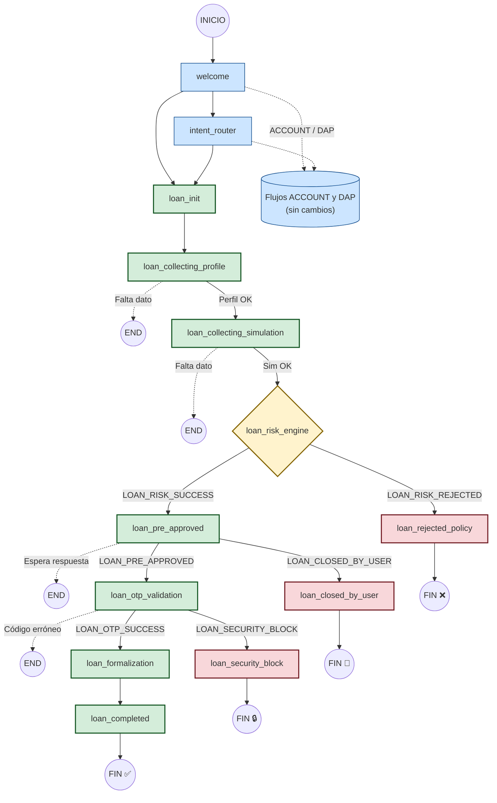

# Implementación del Flujo Completo de Crédito de Consumo — FLUX

> **Versión:** 3.0  
> **Scope:** Expansión del Happy Path de crédito (`LOAN_RISK_ENGINE → LOAN_COMPLETED`) y manejo de excepciones (`REJECTED`, `SECURITY_BLOCK`, `CLOSED_BY_USER`).  
> **Restricciones respetadas:** `welcome`, `intent_router`, `loan_collecting_profile` y `loan_collecting_sim` no son tocados. La estructura de mapas solo se expande, nunca se reemplaza.

---

## Índice

1. [Mapa de Cambios por Archivo](#1-mapa-de-cambios-por-archivo)  
2. [Paso 1 — Constantes y Mapas de Ruteo](#2-paso-1--constantes-y-mapas-de-ruteo)  
3. [Paso 2 — Stubs en `credit.py`](#3-paso-2--stubs-en-creditpy)  
4. [Paso 3 — Grafo en `workflow.py`](#4-paso-3--grafo-en-workflowpy)  
5. [Paso 4 — Edges de Excepción](#5-paso-4--edges-de-excepción)  
6. [Validaciones](#6-validaciones)  
7. [Diagrama de Arquitectura Final](#7-diagrama-de-arquitectura-final)  

---

## 1. Mapa de Cambios por Archivo

| Archivo | Tipo de Cambio | Descripción |
|---|---|---|
| `constants.py` | **Expansión** | 6 nuevas constantes en `CompletedStep` |
| `edges.py` | **Expansión** | `_RESUME_MAP`, `_SUCCESS_MAP`, `_VALID_DESTINATION_NODES` + 4 funciones de ruteo nuevas |
| `nodes/credit.py` | **Adición** | 7 stubs de nodos (sin tocar los existentes) |
| `workflow.py` | **Expansión** | Registro de 7 nodos + redirección de `loan_init → loan_collecting_profile` + aristas condicionales |

---

## 2. Paso 1 — Constantes y Mapas de Ruteo

### 2.1 `app/graph/constants.py` — Versión completa

```python
"""
app/graph/constants.py
─────────────────────────────────────────────────────────────
Constantes de negocio compartidas por nodos y edges.

VERSIÓN: 2.0 — Flujo completo de Crédito de Consumo.
CAMBIOS:
  - CompletedStep: agregados LOAN_RISK_SUCCESS, LOAN_RISK_REJECTED,
    LOAN_PRE_APPROVED, LOAN_OTP_SUCCESS, LOAN_SECURITY_BLOCK, LOAN_CLOSED_BY_USER.
"""


class CompletedStep:
    """
    Valores válidos para session["just_completed_step"].
    Flag volátil: vive exactamente un turno.
    Se setea al completar un paso; se limpia en el return del nodo generador.
    """
    # ── Recolección (ya existentes) ───────────────────────────
    LOAN_PROFILE    = "LOAN_PROFILE"
    LOAN_SIMULATION = "LOAN_SIMULATION"
    ACCOUNT_PROFILE = "ACCOUNT_PROFILE"
    DAP_DATA        = "DAP_DATA"

    # ── Evaluación y Oferta (NUEVOS) ──────────────────────────
    LOAN_RISK_SUCCESS  = "LOAN_RISK_SUCCESS"   # Motor calculó y aprobó
    LOAN_RISK_REJECTED = "LOAN_RISK_REJECTED"  # Motor calculó y rechazó por política

    # ── Formalización (NUEVOS) ────────────────────────────────
    LOAN_PRE_APPROVED  = "LOAN_PRE_APPROVED"   # Usuario aceptó la oferta
    LOAN_OTP_SUCCESS   = "LOAN_OTP_SUCCESS"    # OTP validado correctamente

    # ── Excepciones (NUEVOS) ──────────────────────────────────
    LOAN_SECURITY_BLOCK  = "LOAN_SECURITY_BLOCK"   # 3 intentos OTP fallidos
    LOAN_CLOSED_BY_USER  = "LOAN_CLOSED_BY_USER"   # Usuario rechazó la oferta


class ProductPrefix:
    """
    Prefijos de producto para inferir el producto desde current_node.
    Sin cambios vs v1.0.
    """
    LOAN    = "LOAN"
    ACCOUNT = "ACCOUNT"
    DAP     = "DAP"

    NODE_TO_PRODUCT: dict[str, str] = {
        "LOAN":    LOAN,
        "ACCOUNT": ACCOUNT,
        "DAP":     DAP,
    }

    @classmethod
    def from_node(cls, current_node: str) -> str | None:
        for prefix, product in cls.NODE_TO_PRODUCT.items():
            if current_node.startswith(prefix):
                return product
        return None
```

---

### 2.2 `app/graph/edges.py` — Sección de Mapas (reemplazar los tres bloques de constantes)

> **INSTRUCCIÓN:** Reemplazar únicamente los tres bloques `_RESUME_MAP`, `_SUCCESS_MAP` y `_VALID_DESTINATION_NODES`. El resto del archivo permanece intacto.

```python
# ===================================================================
# ========================== MAPAS DE RUTEO =========================
# ===================================================================

# Mapa de reanudación: current_node (UPPER) → ID LangGraph (snake_case)
# VERSIÓN 2.0: Nodos de oferta, formalización y excepciones de crédito agregados.
_RESUME_MAP = {
    # Crédito de Consumo — Recolección
    "LOAN_INIT":                   "loan_init",
    "LOAN_COLLECTING_PROFILE":     "loan_collecting_profile",
    "LOAN_COLLECTING_SIMULATION":  "loan_collecting_simulation",
    # Crédito de Consumo — Evaluación y Oferta (NUEVOS)
    "LOAN_PRE_APPROVED":           "loan_pre_approved",
    "LOAN_OTP_VALIDATION":         "loan_otp_validation",
    # NOTA: LOAN_RISK_ENGINE y LOAN_FORMALIZATION son nodos de servicio automáticos.
    # No tienen reanudación por turno: si el proceso se interrumpe en ellos,
    # la reanudación ocurre vía _SUCCESS_MAP desde el paso previo.

    # Cuenta Corriente
    "ACCOUNT_INIT":                "account_init",
    "ACCOUNT_COLLECTING_PROFILE":  "account_collecting_profile",
    # Depósito a Plazo
    "DAP_INIT":                    "dap_init",
    "DAP_COLLECT_DATA":            "dap_collect_data",
}

# Mapa de intención inicial: product_intent → ID LangGraph
_INTENT_MAP = {
    "LOAN":    "loan_init",
    "ACCOUNT": "account_init",
    "DAP":     "dap_init",
}

# Nodos válidos como destino del _SUCCESS_MAP.
# VERSIÓN 2.0: Nodos de crédito completo agregados.
_VALID_DESTINATION_NODES: frozenset[str] = frozenset({
    # Crédito
    "loan_collecting_profile",
    "loan_collecting_simulation",
    "loan_risk_engine",
    "loan_pre_approved",
    "loan_otp_validation",
    "loan_formalization",
    "loan_completed",
    "loan_rejected_policy",
    "loan_security_block",
    "loan_closed_by_user",
    # Cuenta Corriente
    "account_collecting_profile",
    "account_evaluation_engine",
    # DAP
    "dap_collect_data",
    "dap_investment_engine",
    # Transversales
    "intent_router",
    "general_response",
})

# Mapa de éxito: producto → {CompletedStep → ID LangGraph destino}
# VERSIÓN 2.0: Flujo completo de crédito definido.
_SUCCESS_MAP: dict[str, dict[str, str]] = {
    "LOAN": {
        # Recolección
        CompletedStep.LOAN_PROFILE:    "loan_collecting_simulation",
        CompletedStep.LOAN_SIMULATION: "loan_risk_engine",
        # Evaluación → Oferta
        CompletedStep.LOAN_RISK_SUCCESS:  "loan_pre_approved",
        CompletedStep.LOAN_RISK_REJECTED: "loan_rejected_policy",
        # Oferta → OTP
        CompletedStep.LOAN_PRE_APPROVED:  "loan_otp_validation",
        CompletedStep.LOAN_CLOSED_BY_USER: "loan_closed_by_user",
        # OTP → Formalización
        CompletedStep.LOAN_OTP_SUCCESS:   "loan_formalization",
        CompletedStep.LOAN_SECURITY_BLOCK: "loan_security_block",
    },
    "ACCOUNT": {
        CompletedStep.ACCOUNT_PROFILE: "account_evaluation_engine",
    },
    "DAP": {
        CompletedStep.DAP_DATA: "dap_investment_engine",
    },
}
```

**Razonamiento de diseño del `_SUCCESS_MAP` para LOAN:**

El mapa de éxito refleja el Happy Path y los desvíos de excepción en un solo lugar. Las excepciones (`LOAN_RISK_REJECTED`, `LOAN_CLOSED_BY_USER`, `LOAN_SECURITY_BLOCK`) están incluidas aquí de forma intencional porque el mecanismo P1 de `route_after_welcome` necesita poder saltar a ellas en un turno de reanudación, si el intra-turno no completó el desvío.

---

### 2.3 Prueba Unitaria — Paso 1

```python
# tests/graph/test_success_map.py
"""
Prueba unitaria para verificar la integridad del _SUCCESS_MAP.
Cubre los requisitos de validación del Paso 1.
"""
import pytest
from app.graph.constants import CompletedStep

# Importar los mapas directamente del módulo
from app.graph.edges import _SUCCESS_MAP, _VALID_DESTINATION_NODES


def get_next_node(product: str, completed_step: str) -> str | None:
    """Helper que replica la lógica de búsqueda del _SUCCESS_MAP."""
    return _SUCCESS_MAP.get(product, {}).get(completed_step)


class TestSuccessMapIntegrity:
    """Verifica que el _SUCCESS_MAP define correctamente el Happy Path."""

    def test_simulation_goes_to_risk_engine(self):
        """Requisito explícito del Paso 1."""
        assert get_next_node("LOAN", CompletedStep.LOAN_SIMULATION) == "loan_risk_engine"

    def test_profile_goes_to_simulation(self):
        assert get_next_node("LOAN", CompletedStep.LOAN_PROFILE) == "loan_collecting_simulation"

    def test_risk_success_goes_to_pre_approved(self):
        assert get_next_node("LOAN", CompletedStep.LOAN_RISK_SUCCESS) == "loan_pre_approved"

    def test_risk_rejected_goes_to_rejected_policy(self):
        assert get_next_node("LOAN", CompletedStep.LOAN_RISK_REJECTED) == "loan_rejected_policy"

    def test_pre_approved_goes_to_otp(self):
        assert get_next_node("LOAN", CompletedStep.LOAN_PRE_APPROVED) == "loan_otp_validation"

    def test_closed_by_user_goes_to_closed_node(self):
        assert get_next_node("LOAN", CompletedStep.LOAN_CLOSED_BY_USER) == "loan_closed_by_user"

    def test_otp_success_goes_to_formalization(self):
        assert get_next_node("LOAN", CompletedStep.LOAN_OTP_SUCCESS) == "loan_formalization"

    def test_security_block_goes_to_security_node(self):
        assert get_next_node("LOAN", CompletedStep.LOAN_SECURITY_BLOCK) == "loan_security_block"

    def test_all_loan_destinations_are_valid(self):
        """Todo destino del LOAN debe estar en _VALID_DESTINATION_NODES."""
        for step, destination in _SUCCESS_MAP["LOAN"].items():
            assert destination in _VALID_DESTINATION_NODES, (
                f"Destino '{destination}' del paso '{step}' no está "
                f"registrado en _VALID_DESTINATION_NODES."
            )

    def test_other_products_not_affected(self):
        """Verificar que ACCOUNT y DAP no cambiaron."""
        assert get_next_node("ACCOUNT", CompletedStep.ACCOUNT_PROFILE) == "account_evaluation_engine"
        assert get_next_node("DAP", CompletedStep.DAP_DATA) == "dap_investment_engine"
```

---

## 3. Paso 2 — Stubs en `credit.py`

> **INSTRUCCIÓN:** Agregar los siguientes stubs al final de `app/graph/nodes/credit.py`, después de la función `loan_risk_engine_node` existente. **No modificar ninguna función existente.**

```python
# ======================================================================================================
# STUBS — NODOS POST-RISK (v3.0)
# ======================================================================================================
# Cada stub cumple el contrato mínimo:
#   1. Actualizar session["current_node"] con el valor UPPER correspondiente.
#   2. Limpiar session["just_completed_step"] (flag volátil de turno anterior).
#   3. Retornar el estado con los campos modificados.
#
# La lógica de negocio completa se implementará en sprints posteriores.
# ======================================================================================================

import datetime as _dt  # Alias para evitar colisión con nombres de variables locales


# ──────────────────────────────────────────────────────────────────────────────────────
# LOAN_PRE_APPROVED — Muestra la Tarjeta de Transparencia al usuario
# ──────────────────────────────────────────────────────────────────────────────────────

def loan_pre_approved_node(state: FluxState) -> dict:
    """
    Stub: LOAN_PRE_APPROVED.

    Responsabilidades finales:
      - Leer evaluation_results["loan_engine"] y formatear la oferta.
      - Mostrar la Tarjeta de Transparencia (monto, plazo, cuota, CAE, CTC).
      - Esperar la decisión del usuario (ACCEPTED / REJECTED).
      - Si ACCEPTED: setear just_completed_step = LOAN_PRE_APPROVED
                     y escribir offer_data["loan"]["pre_approval_status"] = "ACCEPTED".
      - Si REJECTED: setear just_completed_step = LOAN_CLOSED_BY_USER.
    """
    session = state.get("session", {})
    nombre  = state.get("preparation_data", {}).get("nombre", "")

    # Leer resultado del motor para construir el mensaje (stub: sin cálculo real)
    engine_result = state.get("evaluation_results", {}).get("loan_engine", {})
    monto    = engine_result.get("monto_aprobado", 0)
    cuota    = engine_result.get("cuota_mensual", 0)
    plazo    = engine_result.get("plazo_aprobado", 0)
    cae      = engine_result.get("cae", 0.0)
    ctc      = engine_result.get("ctc", 0)

    mensaje_oferta = (
        f"🎉 ¡{nombre}, tu crédito fue pre-aprobado!\n\n"
        f"**Resumen de tu oferta:**\n"
        f"- Monto aprobado: ${monto:,} CLP\n"
        f"- Cuota mensual: ${cuota:,} CLP\n"
        f"- Plazo: {plazo} meses\n"
        f"- CAE: {cae:.2%}\n"
        f"- Costo Total del Crédito: ${ctc:,} CLP\n\n"
        "¿Aceptas esta oferta? Responde **Aceptar** o **Rechazar**."
    )

    # STUB: Simula aceptación automática para pruebas de ruteo.
    # En producción, este nodo debe esperar el turno del usuario y
    # evaluar su respuesta antes de setear just_completed_step.
    # ─── REEMPLAZAR por lógica real en Sprint correspondiente ───
    just_completed = CompletedStep.LOAN_PRE_APPROVED  # stub: siempre acepta
    # ────────────────────────────────────────────────────────────

    from langchain_core.messages import AIMessage
    return {
        "session": {
            **session,
            "current_node":      "LOAN_PRE_APPROVED",
            "previous_node":     session.get("current_node"),
            "just_completed_step": just_completed,
        },
        "offer_data": {
            "loan": {
                "pre_approval_status": "ACCEPTED",
                "timestamp_acceptance": _dt.datetime.utcnow().isoformat(),
            }
        },
        "messages": [AIMessage(content=mensaje_oferta)],
    }


# ──────────────────────────────────────────────────────────────────────────────────────
# LOAN_OTP_VALIDATION — Validación del código enviado por email
# ──────────────────────────────────────────────────────────────────────────────────────

def loan_otp_validation_node(state: FluxState) -> dict:
    """
    Stub: LOAN_OTP_VALIDATION.

    Responsabilidades finales:
      - Al entrar por primera vez: generar el OTP (6 dígitos) y enviarlo por email.
      - Leer auth_control["otp_user_input"] del turno actual.
      - Comparar con auth_control["otp_generated"].
      - Si coincide: setear just_completed_step = LOAN_OTP_SUCCESS.
      - Si falla y intentos < 3: incrementar otp_attempts, pedir reintento.
      - Si falla y intentos == 3: setear just_completed_step = LOAN_SECURITY_BLOCK.
    """
    session      = state.get("session", {})
    auth_control = state.get("auth_control", {})
    nombre       = state.get("preparation_data", {}).get("nombre", "")
    mail         = state.get("preparation_data", {}).get("mail", "")

    # STUB: Simula validación exitosa para pruebas de ruteo.
    # ─── REEMPLAZAR por lógica real en Sprint correspondiente ───
    just_completed = CompletedStep.LOAN_OTP_SUCCESS  # stub: siempre válido
    mensaje = (
        f"✅ ¡Código verificado, {nombre}! "
        "Estamos generando tu contrato..."
    )
    # ────────────────────────────────────────────────────────────

    from langchain_core.messages import AIMessage
    return {
        "session": {
            **session,
            "current_node":      "LOAN_OTP_VALIDATION",
            "previous_node":     session.get("current_node"),
            "just_completed_step": just_completed,
        },
        "auth_control": {
            **auth_control,
            "otp_attempts": auth_control.get("otp_attempts", 0),
        },
        "messages": [AIMessage(content=mensaje)],
    }


# ──────────────────────────────────────────────────────────────────────────────────────
# LOAN_FORMALIZATION — Generación y Sellado del Contrato PDF
# ──────────────────────────────────────────────────────────────────────────────────────

def loan_formalization_node(state: FluxState) -> dict:
    """
    Stub: LOAN_FORMALIZATION.

    Responsabilidades finales:
      - Recopilar datos del motor (monto, plazo, cuota, tasa) y del usuario (nombre, rut).
      - Generar el PDF del contrato con ReportLab.
      - Calcular hash SHA-256 del PDF generado.
      - Escribir en offer_data["loan"]: file_contrato_path, hash_sha256, contract_status.
      - Si SIGNED_AND_STAMPED: continuar a loan_completed (via edge fijo).
      - Si GENERATION_FAILED: redirigir a SERVICE_ERROR (futuro).
    """
    session = state.get("session", {})

    # STUB: Simula contrato generado exitosamente.
    # ─── REEMPLAZAR por lógica real (ReportLab + hashlib) ───────
    fake_path   = "/tmp/contrato_stub.pdf"
    fake_hash   = "a" * 64  # SHA-256 de 64 hex chars
    contract_ok = True
    # ────────────────────────────────────────────────────────────

    from langchain_core.messages import AIMessage
    return {
        "session": {
            **session,
            "current_node":      "LOAN_FORMALIZATION",
            "previous_node":     session.get("current_node"),
            "just_completed_step": None,  # Nodo de servicio: no emite CompletedStep propio
        },
        "offer_data": {
            "loan": {
                **state.get("offer_data", {}).get("loan", {}),
                "file_contrato_path": fake_path,
                "hash_sha256":        fake_hash,
                "contract_status":    "SIGNED_AND_STAMPED" if contract_ok else "GENERATION_FAILED",
            }
        },
        "messages": [AIMessage(content="📄 Contrato generado. Procesando cierre...")],
    }


# ──────────────────────────────────────────────────────────────────────────────────────
# LOAN_COMPLETED — Estado Final Exitoso
# ──────────────────────────────────────────────────────────────────────────────────────

def loan_completed_node(state: FluxState) -> dict:
    """
    Stub: LOAN_COMPLETED.

    Responsabilidades finales:
      - Leer offer_data["loan"] y construir el mensaje de felicitaciones.
      - Escribir flow_result con status_code = "SUCCESS".
      - Poblar offer_data["loan"]["display_data"] para el Frontend.
      - Limpiar current_node (flujo terminado).
    """
    session    = state.get("session", {})
    nombre     = state.get("preparation_data", {}).get("nombre", "")
    offer      = state.get("offer_data", {}).get("loan", {})
    file_url   = offer.get("file_contrato_path", "")
    sha256     = offer.get("hash_sha256", "")
    engine     = state.get("evaluation_results", {}).get("loan_engine", {})
    monto      = engine.get("monto_aprobado", 0)

    mensaje = (
        f"🥳 ¡Felicitaciones, {nombre}! Tu **Crédito de Consumo** de "
        f"**${monto:,} CLP** está formalizado.\n\n"
        f"📥 [Descarga tu contrato]({file_url})\n"
        f"🔐 Hash de seguridad: `{sha256[:16]}...`"
    )

    from langchain_core.messages import AIMessage
    return {
        "session": {
            **session,
            "current_node":      "LOAN_COMPLETED",
            "previous_node":     session.get("current_node"),
            "just_completed_step": None,
        },
        "flow_result": {
            "status_code":  "SUCCESS",
            "close_reason": None,
            "product_name": "Crédito de Consumo",
            "closed_at":    _dt.datetime.utcnow().isoformat(),
        },
        "offer_data": {
            "loan": {
                **offer,
                "display_data": {
                    "download_url":  file_url,
                    "main_detail":   f"Monto: ${monto:,} CLP",
                    "security_hash": sha256,
                    "reason":        None,
                }
            }
        },
        "messages": [AIMessage(content=mensaje)],
    }


# ──────────────────────────────────────────────────────────────────────────────────────
# LOAN_REJECTED_POLICY — Rechazo por Política de Crédito
# ──────────────────────────────────────────────────────────────────────────────────────

_REJECTION_MESSAGES = {
    "ERR_EDAD":           "lamentablemente necesitas ser mayor de 18 años para solicitar un crédito con nosotros",
    "ERR_RENTA":          "tu renta declarada está por debajo del mínimo que requerimos para este producto",
    "ERR_ANTIGUEDAD":     "necesitas al menos 6 meses de antigüedad laboral para calificar",
    "ERR_SCORING":        "tu perfil de riesgo actual no cumple los requisitos de nuestra política de crédito",
    "ERR_CAPACIDAD_PAGO": "la cuota mensual supera el 30% de tu renta, por lo que no podemos aprobar esta solicitud",
}

def loan_rejected_policy_node(state: FluxState) -> dict:
    """
    Stub: LOAN_REJECTED_POLICY.

    Responsabilidades finales:
      - Leer evaluation_results["loan_engine"]["motivo_rechazo"].
      - Generar un mensaje de rechazo empático y personalizado.
      - Escribir flow_result con status_code = "REJECTED".
      - Poblar offer_data["loan"]["display_data"]["reason"].
    """
    session = state.get("session", {})
    nombre  = state.get("preparation_data", {}).get("nombre", "")
    engine  = state.get("evaluation_results", {}).get("loan_engine", {})
    motivo  = engine.get("motivo_rechazo", "ERR_SCORING")

    razon_legible = _REJECTION_MESSAGES.get(
        motivo,
        "tu solicitud no pudo ser aprobada en este momento"
    )
    mensaje = (
        f"😔 {nombre}, revisamos tu información con cuidado y, "
        f"{razon_legible}.\n\n"
        "No te desanimes: puedes volver a intentarlo cuando tu situación cambie. "
        "¡Acá vamos a estar!"
    )

    from langchain_core.messages import AIMessage
    return {
        "session": {
            **session,
            "current_node":      "LOAN_REJECTED_POLICY",
            "previous_node":     session.get("current_node"),
            "just_completed_step": None,
        },
        "flow_result": {
            "status_code":  "REJECTED",
            "close_reason": motivo,
            "product_name": "Crédito de Consumo",
            "closed_at":    _dt.datetime.utcnow().isoformat(),
        },
        "offer_data": {
            "loan": {
                "display_data": {
                    "download_url":  None,
                    "main_detail":   None,
                    "security_hash": None,
                    "reason":        motivo,
                }
            }
        },
        "messages": [AIMessage(content=mensaje)],
    }


# ──────────────────────────────────────────────────────────────────────────────────────
# LOAN_SECURITY_BLOCK — Bloqueo por Múltiples Intentos OTP Fallidos
# ──────────────────────────────────────────────────────────────────────────────────────

def loan_security_block_node(state: FluxState) -> dict:
    """
    Stub: LOAN_SECURITY_BLOCK.

    Responsabilidades finales:
      - Registrar el bloqueo en auth_control con block_timestamp.
      - Actualizar user_status en DB a "BLOCKED_SECURITY" (vía Supabase).
      - Escribir flow_result con status_code = "SECURITY_BLOCKED".
      - Este nodo es TERMINAL: no hay retorno al flujo de crédito.
    """
    session      = state.get("session", {})
    auth_control = state.get("auth_control", {})
    nombre       = state.get("preparation_data", {}).get("nombre", "")
    now_iso      = _dt.datetime.utcnow().isoformat()

    mensaje = (
        f"🔒 {nombre}, hemos detectado múltiples intentos fallidos de validación. "
        "Por tu seguridad, esta solicitud ha sido bloqueada temporalmente.\n\n"
        "Recibirás un correo con instrucciones para desbloquear tu cuenta. "
        "Si crees que esto es un error, contáctanos."
    )

    from langchain_core.messages import AIMessage
    return {
        "session": {
            **session,
            "current_node":      "LOAN_SECURITY_BLOCK",
            "previous_node":     session.get("current_node"),
            "just_completed_step": None,
        },
        "auth_control": {
            **auth_control,
            "security_blocked": True,
            "block_timestamp":  now_iso,
        },
        "flow_result": {
            "status_code":  "SECURITY_BLOCKED",
            "close_reason": "MAX_OTP_ATTEMPTS",
            "product_name": "Crédito de Consumo",
            "closed_at":    now_iso,
        },
        "messages": [AIMessage(content=mensaje)],
    }


# ──────────────────────────────────────────────────────────────────────────────────────
# LOAN_CLOSED_BY_USER — Cierre Voluntario (Usuario rechazó la oferta)
# ──────────────────────────────────────────────────────────────────────────────────────

def loan_closed_by_user_node(state: FluxState) -> dict:
    """
    Stub: LOAN_CLOSED_BY_USER.

    Responsabilidades finales:
      - Leer el último estado alcanzado (previous_node) para analytics.
      - Leer evaluation_results["loan_engine"] para capturar monto y cuota rechazados.
      - Escribir flow_result con status_code = "CLOSED_BY_USER".
      - Mensaje empático de despedida.
    """
    session = state.get("session", {})
    nombre  = state.get("preparation_data", {}).get("nombre", "")
    engine  = state.get("evaluation_results", {}).get("loan_engine", {})
    monto   = engine.get("monto_aprobado", 0)
    cuota   = engine.get("cuota_mensual", 0)
    now_iso = _dt.datetime.utcnow().isoformat()

    mensaje = (
        f"Entendido, {nombre}. Si en algún momento cambias de opinión, "
        "¡acá vamos a estar para ayudarte! 👋"
    )

    from langchain_core.messages import AIMessage
    return {
        "session": {
            **session,
            "current_node":      "LOAN_CLOSED_BY_USER",
            "previous_node":     session.get("current_node"),
            "just_completed_step": None,
        },
        "flow_result": {
            "status_code":  "CLOSED_BY_USER",
            "close_reason": "USER_REJECTED_OFFER",
            "product_name": "Crédito de Consumo",
            "closed_at":    now_iso,
        },
        "offer_data": {
            "loan": {
                "display_data": {
                    "download_url":  None,
                    "main_detail":   f"Monto rechazado: ${monto:,} CLP",
                    "security_hash": None,
                    "reason":        "USER_REJECTED_OFFER",
                }
            }
        },
        "messages": [AIMessage(content=mensaje)],
    }
```

### Prueba de compilación — Paso 2

```python
# tests/graph/test_credit_import.py
"""
Verifica que credit.py compila sin errores de importación
y que todos los stubs nuevos son callable.
"""
import pytest


def test_credit_module_imports():
    """El módulo no debe lanzar ninguna excepción al importar."""
    import importlib
    mod = importlib.import_module("app.graph.nodes.credit")
    assert mod is not None


def test_all_stubs_are_callable():
    """Todos los nodos nuevos deben ser funciones invocables."""
    from app.graph.nodes.credit import (
        loan_pre_approved_node,
        loan_otp_validation_node,
        loan_formalization_node,
        loan_completed_node,
        loan_rejected_policy_node,
        loan_security_block_node,
        loan_closed_by_user_node,
    )
    stubs = [
        loan_pre_approved_node,
        loan_otp_validation_node,
        loan_formalization_node,
        loan_completed_node,
        loan_rejected_policy_node,
        loan_security_block_node,
        loan_closed_by_user_node,
    ]
    for stub in stubs:
        assert callable(stub), f"{stub.__name__} no es callable"


def test_stubs_accept_empty_state():
    """
    Un stub llamado con un estado vacío no debe lanzar KeyError.
    Verifica el contrato mínimo de cada nodo.
    """
    from app.graph.nodes.credit import (
        loan_completed_node,
        loan_rejected_policy_node,
        loan_security_block_node,
        loan_closed_by_user_node,
        loan_formalization_node,
    )
    empty_state = {
        "session": {},
        "preparation_data": {},
        "evaluation_results": {},
        "offer_data": {},
        "auth_control": {},
        "flow_result": {},
        "messages": [],
        "user_data": {},
        "collecting_data": {},
    }
    for node_fn in [
        loan_completed_node,
        loan_rejected_policy_node,
        loan_security_block_node,
        loan_closed_by_user_node,
        loan_formalization_node,
    ]:
        result = node_fn(empty_state)
        assert "session" in result, f"{node_fn.__name__} no retorna 'session'"
        assert "current_node" in result["session"], (
            f"{node_fn.__name__} no setea 'current_node' en session"
        )
```

---

## 4. Paso 3 — Grafo en `workflow.py`

### 4.1 Sección de Imports — Agregar

```python
# Agregar a las importaciones existentes de credit.py
from app.graph.nodes.credit import (
    loan_init_node,
    loan_collecting_profile_node,
    loan_collecting_sim_node,
    loan_risk_engine_node,
    # NUEVOS — v3.0
    loan_pre_approved_node,
    loan_otp_validation_node,
    loan_formalization_node,
    loan_completed_node,
    loan_rejected_policy_node,
    loan_security_block_node,
    loan_closed_by_user_node,
)

# Agregar a las importaciones de edges.py
from app.graph.edges import (
    route_after_welcome,
    route_after_intent,
    route_after_loan_collecting_profile,
    route_after_loan_collecting_sim,
    route_after_account_collecting_profile,
    # NUEVOS — v3.0
    route_after_loan_risk_engine,
    route_after_loan_pre_approved,
    route_after_loan_otp_validation,
)
```

### 4.2 Función `build_graph()` — Versión completa

> **INSTRUCCIÓN:** Reemplazar la función `build_graph()` completa. El resto del archivo (`get_compiled_graph`, `get_active_graph`) permanece intacto.

```python
def build_graph() -> StateGraph:
    """
    Construye y retorna el StateGraph sin compilar.

    VERSIÓN: 3.0 — Flujo de crédito completo.
    CAMBIOS vs v1.5:
      - loan_init ya NO apunta a END; ahora apunta a loan_collecting_profile.
      - Registrados: loan_pre_approved, loan_otp_validation, loan_formalization,
        loan_completed, loan_rejected_policy, loan_security_block, loan_closed_by_user.
      - Aristas condicionales: route_after_loan_risk_engine,
        route_after_loan_pre_approved, route_after_loan_otp_validation.
      - Aristas fijas: loan_formalization → loan_completed (Happy Path único post-OTP).

    NOMENCLATURA (Regla de Oro — tabla actualizada):
    ┌──────────────────────────────┬──────────────────────────────────┐
    │ ID LangGraph (snake)         │ Valor current_node (UPPER)       │
    ├──────────────────────────────┼──────────────────────────────────┤
    │ welcome                      │ WELCOME_NODE                     │
    │ intent_router                │ INTENT_ROUTER                    │
    │ loan_init                    │ LOAN_INIT                        │
    │ loan_collecting_profile      │ LOAN_COLLECTING_PROFILE          │
    │ loan_collecting_simulation   │ LOAN_COLLECTING_SIMULATION       │
    │ loan_risk_engine             │ LOAN_RISK_ENGINE                 │
    │ loan_pre_approved            │ LOAN_PRE_APPROVED                │
    │ loan_otp_validation          │ LOAN_OTP_VALIDATION              │
    │ loan_formalization           │ LOAN_FORMALIZATION               │
    │ loan_completed               │ LOAN_COMPLETED                   │
    │ loan_rejected_policy         │ LOAN_REJECTED_POLICY             │
    │ loan_security_block          │ LOAN_SECURITY_BLOCK              │
    │ loan_closed_by_user          │ LOAN_CLOSED_BY_USER              │
    │ account_init                 │ ACCOUNT_INIT                     │
    │ account_collecting_profile   │ ACCOUNT_COLLECTING_PROFILE       │
    │ account_evaluation_engine    │ ACCOUNT_EVALUATION_ENGINE        │
    │ dap_init                     │ DAP_INIT                         │
    │ dap_collect_data             │ DAP_COLLECT_DATA                 │
    │ dap_investment_engine        │ DAP_INVESTMENT_ENGINE            │
    │ general_response             │ GENERAL_RESPONSE                 │
    └──────────────────────────────┴──────────────────────────────────┘
    """
    graph = StateGraph(FluxState)

    # ── Registro de Nodos ─────────────────────────────────────────────
    # Comunes / transversales (sin cambios)
    graph.add_node("welcome",                    welcome_node)
    graph.add_node("intent_router",              intent_router_node)
    graph.add_node("general_response",           general_response_node)

    # Crédito de Consumo — Recolección (sin cambios)
    graph.add_node("loan_init",                  loan_init_node)
    graph.add_node("loan_collecting_profile",    loan_collecting_profile_node)
    graph.add_node("loan_collecting_simulation", loan_collecting_sim_node)
    graph.add_node("loan_risk_engine",           loan_risk_engine_node)

    # Crédito de Consumo — Oferta y Formalización (NUEVOS)
    graph.add_node("loan_pre_approved",          loan_pre_approved_node)
    graph.add_node("loan_otp_validation",        loan_otp_validation_node)
    graph.add_node("loan_formalization",         loan_formalization_node)
    graph.add_node("loan_completed",             loan_completed_node)

    # Crédito de Consumo — Excepciones (NUEVOS)
    graph.add_node("loan_rejected_policy",       loan_rejected_policy_node)
    graph.add_node("loan_security_block",        loan_security_block_node)
    graph.add_node("loan_closed_by_user",        loan_closed_by_user_node)

    # Cuenta Corriente (sin cambios)
    graph.add_node("account_init",               account_init_node)
    graph.add_node("account_collecting_profile", account_collecting_profile_node)
    graph.add_node("account_evaluation_engine",  account_evaluation_engine_node)

    # Depósito a Plazo (sin cambios)
    graph.add_node("dap_init",                   dap_init_node)
    graph.add_node("dap_collect_data",           dap_collect_data_node)
    graph.add_node("dap_investment_engine",      dap_investment_engine_node)

    # ── Punto de Entrada ──────────────────────────────────────────────
    graph.set_entry_point("welcome")

    # ── Aristas Condicionales ─────────────────────────────────────────

    # WELCOME: redirigir según intención (nueva o reanudada)
    # v3.0: se agregan loan_pre_approved y loan_otp_validation al mapa de destinos.
    graph.add_conditional_edges(
        "welcome",
        route_after_welcome,
        {
            # Clasificación
            "intent_router":               "intent_router",
            # Intención directa
            "loan_init":                   "loan_init",
            "account_init":                "account_init",
            "dap_init":                    "dap_init",
            # Reanudación de recolección
            "loan_collecting_profile":     "loan_collecting_profile",
            "loan_collecting_simulation":  "loan_collecting_simulation",
            "account_collecting_profile":  "account_collecting_profile",
            "dap_collect_data":            "dap_collect_data",
            # Reanudación de oferta/OTP (NUEVOS)
            "loan_pre_approved":           "loan_pre_approved",
            "loan_otp_validation":         "loan_otp_validation",
            # Saltos por éxito (desde _SUCCESS_MAP vía P1)
            "loan_risk_engine":            "loan_risk_engine",
            "loan_formalization":          "loan_formalization",
            "loan_rejected_policy":        "loan_rejected_policy",
            "loan_security_block":         "loan_security_block",
            "loan_closed_by_user":         "loan_closed_by_user",
            "account_evaluation_engine":   "account_evaluation_engine",
            "dap_investment_engine":       "dap_investment_engine",
            # General
            "general_response":            "general_response",
        }
    )

    # INTENT_ROUTER: sin cambios
    graph.add_conditional_edges(
        "intent_router",
        route_after_intent,
        {
            "loan_init":        "loan_init",
            "account_init":     "account_init",
            "dap_init":         "dap_init",
            "general_response": "general_response",
        }
    )

    # ── Rutas de Crédito de Consumo ───────────────────────────────────

    # v3.0: loan_init → loan_collecting_profile (ya NO va a END)
    # Razón: loan_init es un nodo de bienvenida automático que no espera input.
    # Transiciona directamente al primer nodo de recolección en el mismo turno.
    graph.add_edge("loan_init", "loan_collecting_profile")

    # Recolección de perfil (con salto condicional al completarse)
    graph.add_conditional_edges(
        "loan_collecting_profile",
        route_after_loan_collecting_profile,
        {
            "loan_collecting_simulation": "loan_collecting_simulation",
            END: END,
        }
    )

    # Recolección de simulación (con salto al motor al completarse)
    graph.add_conditional_edges(
        "loan_collecting_simulation",
        route_after_loan_collecting_sim,
        {
            "loan_risk_engine": "loan_risk_engine",
            END: END,
        }
    )

    # Motor de riesgo (bifurcación: aprobado / rechazado)
    graph.add_conditional_edges(
        "loan_risk_engine",
        route_after_loan_risk_engine,
        {
            "loan_pre_approved":    "loan_pre_approved",
            "loan_rejected_policy": "loan_rejected_policy",
        }
    )

    # Oferta (bifurcación: aceptada / rechazada por usuario)
    graph.add_conditional_edges(
        "loan_pre_approved",
        route_after_loan_pre_approved,
        {
            "loan_otp_validation": "loan_otp_validation",
            "loan_closed_by_user": "loan_closed_by_user",
            END: END,  # Espera turno del usuario
        }
    )

    # Validación OTP (bifurcación: éxito / bloqueo de seguridad)
    graph.add_conditional_edges(
        "loan_otp_validation",
        route_after_loan_otp_validation,
        {
            "loan_formalization": "loan_formalization",
            "loan_security_block": "loan_security_block",
            END: END,  # Espera turno del usuario (código incorrecto, reintento)
        }
    )

    # Formalización → Completado (edge fijo: nodo de servicio automático)
    # Si GENERATION_FAILED, se añadirá un edge a SERVICE_ERROR en sprint futuro.
    graph.add_edge("loan_formalization", "loan_completed")

    # Nodos terminales → END
    graph.add_edge("loan_completed",      END)
    graph.add_edge("loan_rejected_policy", END)
    graph.add_edge("loan_security_block",  END)
    graph.add_edge("loan_closed_by_user",  END)

    # ── Rutas de Cuenta Corriente (sin cambios) ───────────────────────
    graph.add_edge("account_init", END)

    graph.add_conditional_edges(
        "account_collecting_profile",
        route_after_account_collecting_profile,
        {
            "account_evaluation_engine": "account_evaluation_engine",
            END: END,
        }
    )

    graph.add_edge("account_evaluation_engine", END)

    # ── Rutas de Depósito a Plazo (sin cambios) ───────────────────────
    graph.add_edge("dap_init",            "dap_collect_data")
    graph.add_edge("dap_collect_data",    "dap_investment_engine")
    graph.add_edge("dap_investment_engine", END)

    # ── Nodos Transversales (sin cambios) ─────────────────────────────
    graph.add_edge("general_response", END)

    return graph
```

### 4.3 Validación del grafo — Paso 3

```python
# scripts/validate_graph.py
"""
Genera el dibujo ASCII del grafo y lo imprime para comparación visual con el Mermaid.
Ejecutar desde la raíz del proyecto:
  python -m scripts.validate_graph
"""
from app.graph.workflow import build_graph

def main():
    graph = build_graph()
    compiled = graph.compile()  # Sin checkpointer para validación
    print("\n=== GRAFO FLUX — ASCII ===\n")
    compiled.get_graph().print_ascii()
    print("\n")

if __name__ == "__main__":
    main()
```

---

## 5. Paso 4 — Edges de Excepción

> **INSTRUCCIÓN:** Agregar las siguientes funciones al final de `app/graph/edges.py`, después de `route_after_account_collecting_profile`.

```python
# ── Edges Nuevos — v3.0: Post-Risk, Post-PreApproved, Post-OTP ─────────────

def route_after_loan_risk_engine(state: FluxState) -> str:
    """
    Decisión de arista post-loan_risk_engine.

    El motor de riesgo es un nodo de servicio automático: siempre completa
    su trabajo en el mismo turno y emite exactamente uno de dos CompletedStep:
      - LOAN_RISK_SUCCESS  → loan_pre_approved
      - LOAN_RISK_REJECTED → loan_rejected_policy

    NOTA: Este edge NO tiene rama END porque loan_risk_engine nunca
    espera input del usuario. Si just_completed_step es None o inesperado,
    se redirige a loan_rejected_policy como fallback seguro (evita loop).
    """
    session        = state.get("session", {})
    just_completed = session.get("just_completed_step")

    if just_completed == CompletedStep.LOAN_RISK_SUCCESS:
        return "loan_pre_approved"
    if just_completed == CompletedStep.LOAN_RISK_REJECTED:
        return "loan_rejected_policy"

    # Fallback defensivo: si el motor no emitió señal, redirigir a rechazo
    _routing_logger.warning(
        f"route_after_loan_risk_engine: just_completed_step='{just_completed}' "
        "inesperado. Redirigiendo a 'loan_rejected_policy' como fallback."
    )
    return "loan_rejected_policy"


def route_after_loan_pre_approved(state: FluxState) -> str:
    """
    Decisión de arista post-loan_pre_approved.

    Este nodo espera la decisión del usuario (ACCEPTED / REJECTED).
    La señal viaja en just_completed_step:
      - LOAN_PRE_APPROVED  → loan_otp_validation  (usuario aceptó)
      - LOAN_CLOSED_BY_USER → loan_closed_by_user  (usuario rechazó)
      - None               → END                   (primer turno: espera respuesta)

    REGLA: Si el nodo acaba de generar la tarjeta de transparencia y aún
    no hay respuesta del usuario, just_completed_step será None → END.
    En el siguiente turno, el nodo vuelve a ejecutarse, lee la respuesta
    y emite el CompletedStep correspondiente.
    """
    session        = state.get("session", {})
    just_completed = session.get("just_completed_step")

    if just_completed == CompletedStep.LOAN_PRE_APPROVED:
        return "loan_otp_validation"
    if just_completed == CompletedStep.LOAN_CLOSED_BY_USER:
        return "loan_closed_by_user"

    return END  # Esperar respuesta del usuario


def route_after_loan_otp_validation(state: FluxState) -> str:
    """
    Decisión de arista post-loan_otp_validation.

    El nodo OTP espera que el usuario ingrese el código.
    La señal viaja en just_completed_step:
      - LOAN_OTP_SUCCESS   → loan_formalization    (código correcto)
      - LOAN_SECURITY_BLOCK → loan_security_block  (3 intentos fallidos)
      - None               → END                   (código incorrecto, reintento)

    DISEÑO DE RETENCIÓN: Cuando el código es incorrecto pero hay intentos
    disponibles, el nodo actualiza el contador en auth_control y retorna
    sin setear just_completed_step → este edge retorna END → el grafo espera
    otro turno → el nodo OTP vuelve a ejecutarse en el siguiente mensaje.
    """
    session        = state.get("session", {})
    just_completed = session.get("just_completed_step")

    if just_completed == CompletedStep.LOAN_OTP_SUCCESS:
        return "loan_formalization"
    if just_completed == CompletedStep.LOAN_SECURITY_BLOCK:
        return "loan_security_block"

    return END  # Código incorrecto: esperar reintento del usuario
```

### Prueba de Simulación — Paso 4

```python
# tests/graph/test_exception_edges.py
"""
Simula estados con just_completed_step para verificar que cada edge
apunta al destino correcto.
"""
import pytest
from langgraph.graph import END
from app.graph.constants import CompletedStep
from app.graph.edges import (
    route_after_loan_risk_engine,
    route_after_loan_pre_approved,
    route_after_loan_otp_validation,
)


def _make_state(just_completed: str | None) -> dict:
    return {
        "session": {"just_completed_step": just_completed},
        "messages": [],
        "user_data": {},
        "preparation_data": {},
        "collecting_data": {},
        "evaluation_results": {},
        "offer_data": {},
        "auth_control": {},
        "flow_result": {},
    }


class TestRouteAfterRiskEngine:
    def test_risk_success_goes_to_pre_approved(self):
        state = _make_state(CompletedStep.LOAN_RISK_SUCCESS)
        assert route_after_loan_risk_engine(state) == "loan_pre_approved"

    def test_risk_rejected_goes_to_rejected_policy(self):
        state = _make_state(CompletedStep.LOAN_RISK_REJECTED)
        assert route_after_loan_risk_engine(state) == "loan_rejected_policy"

    def test_unknown_step_goes_to_rejected_policy_as_fallback(self):
        state = _make_state(None)
        assert route_after_loan_risk_engine(state) == "loan_rejected_policy"


class TestRouteAfterPreApproved:
    def test_pre_approved_accepted_goes_to_otp(self):
        state = _make_state(CompletedStep.LOAN_PRE_APPROVED)
        assert route_after_loan_pre_approved(state) == "loan_otp_validation"

    def test_closed_by_user_goes_to_closed_node(self):
        state = _make_state(CompletedStep.LOAN_CLOSED_BY_USER)
        assert route_after_loan_pre_approved(state) == "loan_closed_by_user"

    def test_waiting_for_user_goes_to_end(self):
        state = _make_state(None)
        assert route_after_loan_pre_approved(state) == END


class TestRouteAfterOtp:
    def test_otp_success_goes_to_formalization(self):
        state = _make_state(CompletedStep.LOAN_OTP_SUCCESS)
        assert route_after_loan_otp_validation(state) == "loan_formalization"

    def test_security_block_goes_to_security_node(self):
        # Validación explícita del Paso 4 (requisito del enunciado)
        state = _make_state(CompletedStep.LOAN_SECURITY_BLOCK)
        assert route_after_loan_otp_validation(state) == "loan_security_block"

    def test_wrong_code_still_waiting_goes_to_end(self):
        state = _make_state(None)
        assert route_after_loan_otp_validation(state) == END
```

---

## 6. Validaciones

### 6.1 Checklist de Validación por Paso

| Paso | Check | Comando / Método |
|---|---|---|
| 1 | `_SUCCESS_MAP["LOAN"][LOAN_SIMULATION] == "loan_risk_engine"` | `pytest tests/graph/test_success_map.py -v` |
| 1 | Todos los destinos LOAN en `_VALID_DESTINATION_NODES` | `pytest tests/graph/test_success_map.py::TestSuccessMapIntegrity::test_all_loan_destinations_are_valid` |
| 2 | `credit.py` compila sin errores | `pytest tests/graph/test_credit_import.py -v` |
| 2 | Stubs aceptan estado vacío sin `KeyError` | `pytest tests/graph/test_credit_import.py::test_stubs_accept_empty_state` |
| 3 | Grafo ASCII coincide con Mermaid | `python -m scripts.validate_graph` |
| 4 | `LOAN_SECURITY_BLOCK` → `loan_security_block` | `pytest tests/graph/test_exception_edges.py::TestRouteAfterOtp::test_security_block_goes_to_security_node` |
| 4 | Suite completa de edges | `pytest tests/graph/test_exception_edges.py -v` |

### 6.2 Ejecución completa

```bash
# Desde la raíz del proyecto
pytest tests/graph/test_success_map.py \
       tests/graph/test_credit_import.py \
       tests/graph/test_exception_edges.py \
       -v --tb=short

# Validación visual del grafo
python -m scripts.validate_graph
```

---

## 7. Diagrama de Arquitectura Final

El siguiente Mermaid describe el grafo resultante con todos los nodos y aristas implementados. Incluye el Happy Path (verde), las excepciones (rojo) y los nodos de espera inter-turno (línea punteada → END).



---

## Notas Finales

### Decisiones de Diseño

**`loan_init → loan_collecting_profile` (edge fijo, ya no va a END)**  
`loan_init` es un nodo de bienvenida automático que no espera input del usuario. Conectarlo directamente a `loan_collecting_profile` en el mismo turno evita un round-trip innecesario al cliente y es consistente con el diseño de los nodos `dap_init → dap_collect_data`.

**Nodos de servicio fuera del `_RESUME_MAP`**  
`LOAN_RISK_ENGINE` y `LOAN_FORMALIZATION` no se agregan al `_RESUME_MAP` porque son nodos automáticos sin estado de espera de usuario. Si el proceso se interrumpe mientras están en curso, el mecanismo P1 de `route_after_welcome` los alcanzará vía `_SUCCESS_MAP` desde el `CompletedStep` del paso anterior.

**Fallback en `route_after_loan_risk_engine`**  
A diferencia de los otros edges, el motor de riesgo no tiene rama `END` porque siempre produce una señal en el mismo turno. Si `just_completed_step` es inesperado (bug en el motor), el fallback a `loan_rejected_policy` es el camino más seguro y auditable.

**Stubs con aceptación automática**  
Los stubs de `loan_pre_approved_node` y `loan_otp_validation_node` simulan éxito para facilitar el testing de ruteo. El comentario `# REEMPLAZAR` marca claramente el bloque que debe ser reemplazado por la lógica real en el sprint correspondiente, sin afectar la compilación del grafo ni los tests de estructura.