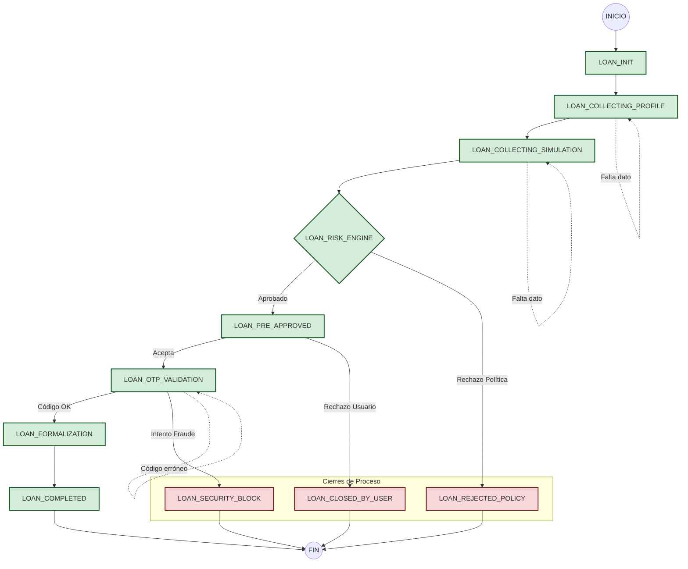

```mermaid
graph TD
    %% Estilos
    classDef happyPath fill:#d4edda,stroke:#155724,stroke-width:2px
    classDef exception fill:#f8d7da,stroke:#721c24,stroke-width:2px
    classDef startNode fill:#f9f,stroke:#333,stroke-width:2px

    %% Nodos Happy Path
    START((INICIO)) --> loan_init[LOAN_INIT]:::happyPath
    loan_init --> profile[LOAN_COLLECTING_PROFILE]:::happyPath
    profile --> sim[LOAN_COLLECTING_SIMULATION]:::happyPath
    sim --> risk{LOAN_RISK_ENGINE}:::happyPath
    
    risk -- "Aprobado" --> pre_app[LOAN_PRE_APPROVED]:::happyPath
    pre_app -- "Acepta" --> otp[LOAN_OTP_VALIDATION]:::happyPath
    otp -- "Código OK" --> formal[LOAN_FORMALIZATION]:::happyPath
    formal --> completed[LOAN_COMPLETED]:::happyPath
    completed --> END((FIN))

    %% Nodos de Excepción (Salidas de Emergencia)
    subgraph Excepciones [Cierres de Proceso]
        rejected[LOAN_REJECTED_POLICY]:::exception
        sec_block[LOAN_SECURITY_BLOCK]:::exception
        closed[LOAN_CLOSED_BY_USER]:::exception
    end

    %% Cableado de Excepciones
    risk -- "Rechazo Política" --> rejected
    pre_app -- "Rechazo Usuario" --> closed
    otp -- "Intento Fraude" --> sec_block
    
    %% Loops de espera (Cuando el dato no es válido, el nodo se queda ahí)
    profile -.-> |"Falta dato"| profile
    sim -.-> |"Falta dato"| sim
    otp -.-> |"Código erróneo"| otp

    %% Salidas Finales
    rejected --> END
    sec_block --> END
    closed --> END
```