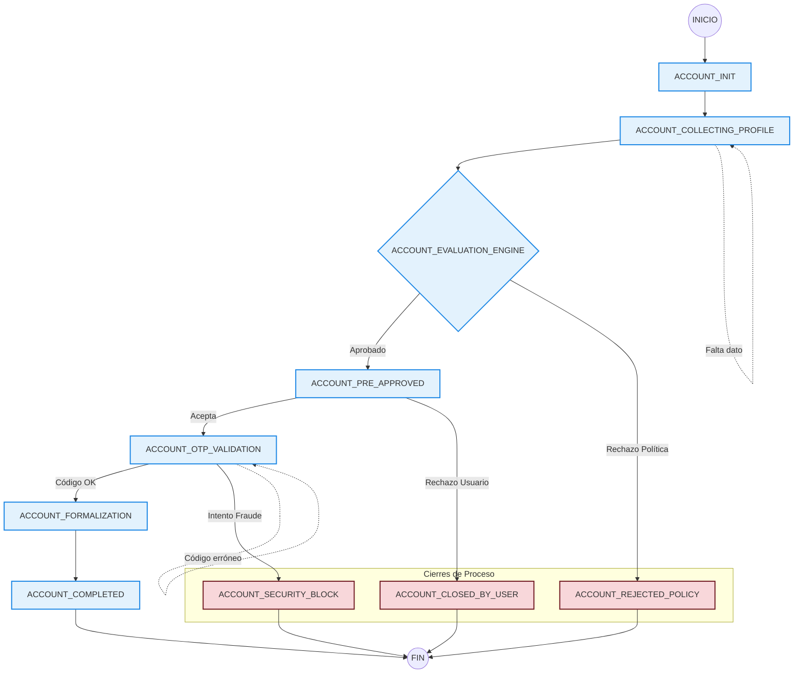

```mermaid
graph TD
    %% Estilos
    classDef happyPath fill:#e3f2fd,stroke:#1e88e5,stroke-width:2px
    classDef exception fill:#f8d7da,stroke:#721c24,stroke-width:2px
    classDef startNode fill:#f9f,stroke:#333,stroke-width:2px

    %% Nodos Happy Path (Prefijo ACCOUNT)
    START((INICIO)) --> account_init[ACCOUNT_INIT]:::happyPath
    account_init --> profile[ACCOUNT_COLLECTING_PROFILE]:::happyPath
    
    %% Transición directa al motor (Sin Simulación)
    profile --> engine{ACCOUNT_EVALUATION_ENGINE}:::happyPath
    
    engine -- "Aprobado" --> pre_app[ACCOUNT_PRE_APPROVED]:::happyPath
    pre_app -- "Acepta" --> otp[ACCOUNT_OTP_VALIDATION]:::happyPath
    otp -- "Código OK" --> formal[ACCOUNT_FORMALIZATION]:::happyPath
    formal --> completed[ACCOUNT_COMPLETED]:::happyPath
    completed --> END((FIN))

    %% Nodos de Excepción (Salidas de Emergencia)
    subgraph Excepciones [Cierres de Proceso]
        rejected[ACCOUNT_REJECTED_POLICY]:::exception
        sec_block[ACCOUNT_SECURITY_BLOCK]:::exception
        closed[ACCOUNT_CLOSED_BY_USER]:::exception
    end

    %% Cableado de Excepciones
    engine -- "Rechazo Política" --> rejected
    pre_app -- "Rechazo Usuario" --> closed
    otp -- "Intento Fraude" --> sec_block
    
    %% Loops de espera y re-entry
    profile -.-> |"Falta dato"| profile
    otp -.-> |"Código erróneo"| otp

    %% Salidas Finales
    rejected --> END
    sec_block --> END
    closed --> END
```