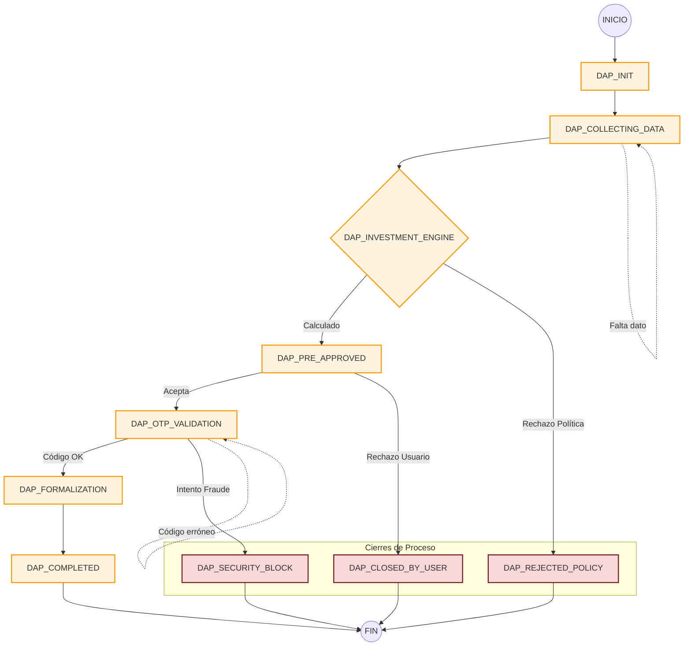

```mermaid
graph TD
    %% Estilos
    classDef happyPath fill:#fff3e0,stroke:#ff9800,stroke-width:2px
    classDef exception fill:#f8d7da,stroke:#721c24,stroke-width:2px
    classDef startNode fill:#f9f,stroke:#333,stroke-width:2px

    %% Nodos Happy Path (Prefijo DAP)
    START((INICIO)) --> dap_init[DAP_INIT]:::happyPath
    dap_init --> collect[DAP_COLLECTING_DATA]:::happyPath
    
    %% Transición directa al motor (Simétrico a Cuenta Corriente)
    collect --> engine{DAP_INVESTMENT_ENGINE}:::happyPath
    
    engine -- "Calculado" --> pre_app[DAP_PRE_APPROVED]:::happyPath
    pre_app -- "Acepta" --> otp[DAP_OTP_VALIDATION]:::happyPath
    otp -- "Código OK" --> formal[DAP_FORMALIZATION]:::happyPath
    formal --> completed[DAP_COMPLETED]:::happyPath
    completed --> END((FIN))

    %% Nodos de Excepción
    subgraph Excepciones_DAP [Cierres de Proceso]
        rejected[DAP_REJECTED_POLICY]:::exception
        sec_block[DAP_SECURITY_BLOCK]:::exception
        closed[DAP_CLOSED_BY_USER]:::exception
    end

    %% Cableado de Excepciones
    engine -- "Rechazo Política" --> rejected
    pre_app -- "Rechazo Usuario" --> closed
    otp -- "Intento Fraude" --> sec_block
    
    %% Loops de re-entry
    collect -.-> |"Falta dato"| collect
    otp -.-> |"Código erróneo"| otp

    %% Salidas Finales
    rejected --> END
    sec_block --> END
    closed --> END
```